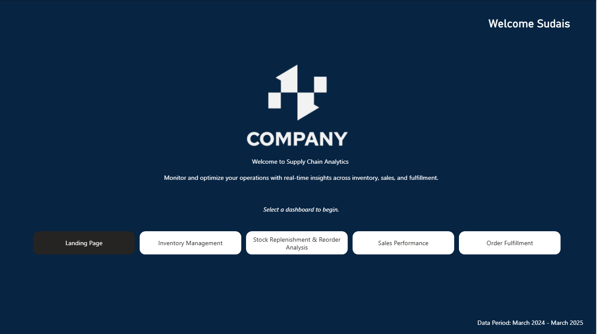
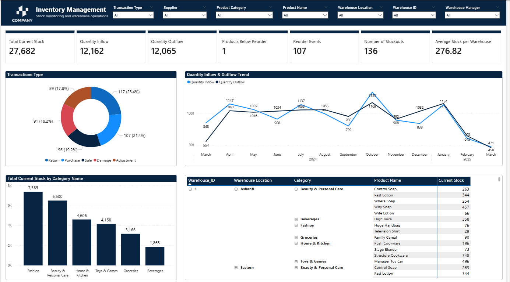
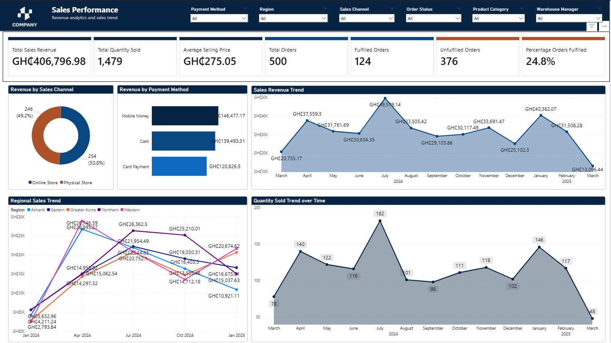
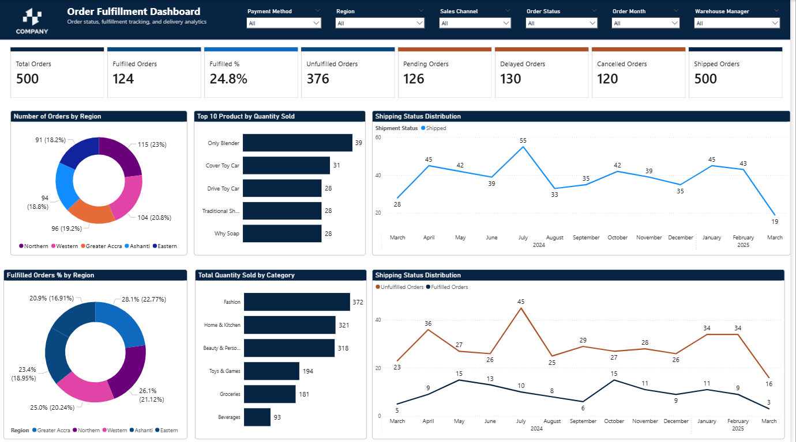

# Supply Chain Analytics Dashboard - Adom Retail Ltd


> **Integrated Business Intelligence Dashboard System for Supply Chain Management**

A comprehensive Power BI dashboard solution designed to transform Adom Retail Ltd's supply chain operations from fragmented Excel reports to data-driven decision-making. This project analyzes 13 months of operational data (March 2024 - March 2025) across inventory, sales, fulfillment, and replenishment functions.

---

## 📊 Project Overview

**Author:** Sudais Abdul Hamid  
**Role:** Business Intelligence Analyst  
**Tools:** Microsoft Power BI, DAX, Power Query  

### Business Context

Adom Retail Ltd, a mid-sized retail company operating across Ghana, faces critical supply chain challenges:
- Frequent stockouts of key products
- Order fulfillment delays affecting customer satisfaction
- Limited operational visibility across multiple warehouses
- Difficulty tracking supplier and inventory performance

This dashboard system addresses these challenges through integrated analytics covering:
- ✅ Inventory Management
- ✅ Stock Replenishment
- ✅ Sales Performance
- ✅ Order Fulfillment

---

## 🎯 Key Features

### **Dashboard 1: Inventory Management**
- Real-time stock levels across 6 product categories
- Transaction type analysis (Purchase, Sale, Return, Damage, Adjustment)
- Warehouse-level inventory distribution
- Category performance breakdown
- Inflow/Outflow trend analysis

### **Dashboard 2: Stock Replenishment**
- Reorder event tracking over time
- Stock level trend analysis (13-month historical view)
- Products below reorder level alerts
- Stockout prevention monitoring
- Replenishment effectiveness metrics

### **Dashboard 3: Sales Performance**
- Revenue trends by region, channel, and payment method
- Sales channel comparison (Online vs. Physical)
- Regional sales performance (5 regions)
- Payment method distribution (Mobile Money, Cash, Card)
- Quantity sold trend analysis

### **Dashboard 4: Order Fulfillment**
- Order status tracking (Fulfilled, Pending, Delayed, Cancelled)
- Shipping performance (100% completion rate)
- Fulfillment rate analysis (24.8% current rate)
- Regional order distribution
- Top product performance by quantity

---

## 📈 Key Insights

### Critical Findings

🔴 **Urgent Issues:**
- **Low Fulfillment Rate:** Only 24.8% of orders fulfilled despite 100% shipment completion
- **Revenue Decline:** 73% drop from July 2024 peak (GH₵49.2K) to March 2025 (GH₵13.1K)
- **Quantity Collapse:** 74% decline in units sold (182 → 48 units/month)

⚠️ **Operational Challenges:**
- **136 stockout events** despite adequate aggregate inventory (distribution problem)
- **High damage rate:** 19.2% of transactions
- **High return rate:** 17.8% of transactions
- **Overstock risk:** Current inventory (27,682 units) supports 577 months at current sales rates

✅ **Strengths:**
- Strong inventory management (only 1 product below reorder level)
- 100% shipment completion rate
- Balanced sales channels (50.8% online, 49.2% physical)
- Responsive reorder system (8.2 events/month average)

---

## 🗂️ Repository Structure

```
supply-chain-analytics/
│
├── README.md                           # This file
├── Supply_Chain_Analytics.pbix         # Power BI dashboard file
├── Supply_Chain_Analytics_Report.docx  # 3-page written analysis
│
├── data/
│   └── Demand_Supply_Data_Final.xlsx   # Source data (not included - confidential)
│
├── screenshots/
│   ├── 01_landing_page.png
│   ├── 02_inventory_management.png
│   ├── 03_stock_replenishment.png
│   ├── 04_sales_performance.png
│   └── 05_order_fulfillment.png
│
└── docs/
    ├── data_model.png                  # Star schema diagram
    └── dax_formulas.md                 # Key DAX measures used
```

---

## 🛠️ Technical Specifications

### Tools & Technologies
- **Primary Tool:** Microsoft Power BI Desktop
- **Data Source:** Excel (.xlsx)
- **Data Model:** Star schema with 4 fact tables, 5+ dimension tables
- **DAX Measures:** 47+ custom calculations
- **Visualization Types:** Line charts, bar charts, donut charts, tables, KPI cards, area charts

### Data Model

**Fact Tables:**
- `Sales` - Transaction-level sales data
- `Inventory` - Inventory transaction records
- `Shipment` - Shipping and delivery records
- `Stock_Levels` - Current stock positions

**Dimension Tables:**
- `Product` - Product catalog
- `Warehouse` - Warehouse details
- `Supplier` - Supplier information
- `Date` - Calendar dimension
- `Customer` - Customer data

**Relationships:** One-to-many from dimensions to facts

### Key DAX Formulas

**Running Stock Balance:**
```dax
Running Stock = 
VAR CurrentDate = MAX(Inventory[Transaction_Date])
RETURN
CALCULATE(
    SUM(Inventory[Quantity_In]) - SUM(Inventory[Quantity_Out]),
    FILTER(
        ALL(Inventory[Transaction_Date]),
        Inventory[Transaction_Date] <= CurrentDate
    )
)
```

**Reorder Events:**
```dax
Reorder Events = 
SUMX(
    Inventory,
    VAR StockAfterTransaction = [Running Stock]
    VAR ReorderLevel = RELATED(Stock_Levels[Reorder_Level])
    RETURN IF(StockAfterTransaction <= ReorderLevel, 1, 0)
)
```

**Ship Rate:**
```dax
Ship Rate % = 
DIVIDE(
    CALCULATE(COUNTROWS(Orders), NOT(ISBLANK(RELATED(Shipment[Shipment_Date])))),
    COUNTROWS(Orders),
    0
)
```

---

## 📊 Dashboard Screenshots

### Landing Page


### Inventory Management Dashboard


### Sales Performance Dashboard


### Order Fulfillment Dashboard


---

## 🚀 Getting Started

### Prerequisites
- Microsoft Power BI Desktop (latest version)
- Excel 2016 or later (for data source)
- Windows 10/11 (recommended)

### Installation

1. **Clone the repository:**
   ```bash
   git clone https://github.com/yourusername/supply-chain-analytics.git
   cd supply-chain-analytics
   ```

2. **Open the Power BI file:**
   - Launch Power BI Desktop
   - Open `Supply_Chain_Analytics.pbix`

3. **Refresh data (if needed):**
   - Click **Home** → **Refresh**
   - Note: Data source path may need updating

### Data Source Configuration

If the data source path needs updating:
1. Go to **Home** → **Transform Data** → **Data Source Settings**
2. Update the file path to your local `Demand_Supply_Data_Final.xlsx` location
3. Click **Refresh** to reload data

---

## 📝 Methodology

### Challenges Overcome

**1. Historical Stock Level Reconstruction**
- **Problem:** Stock_Levels table had only snapshot data (single date)
- **Solution:** Calculated running stock from Inventory transactions using cumulative sum

**2. Reorder Event Identification**
- **Problem:** No explicit "Reorder" transaction type in data
- **Solution:** Inferred reorder events by detecting stock crossing below reorder thresholds

**3. Fulfillment vs. Shipment Distinction**
- **Finding:** 100% of orders shipped, but only 24.8% fulfilled
- **Interpretation:** "Fulfilled" encompasses post-delivery processes (payment, acceptance) beyond physical delivery

### Key Assumptions

- **Fulfillment Definition:** Represents complete order cycle including payment and customer acceptance
- **Stockout Counting:** 136 events represent frequency across all products/warehouses, not unique products
- **Reorder Levels:** Current thresholds assumed constant throughout analysis period
- **Opening Stock:** Calculated as Current Stock minus Total Net Movement

---

## 📖 Documentation

### Report Contents

The accompanying **3-page written report** (`Supply_Chain_Analytics_Report.docx`) includes:

**Page 1: Key Insights**
- Detailed findings from each dashboard
- Critical performance indicators
- Operational strengths and weaknesses

**Page 2: Integrated Narrative**
- Cross-dashboard insights
- The Fulfillment Paradox explained
- Strategic goal assessment
- Dashboard interconnections

**Page 3: Challenges & Conclusion**
- Technical implementation challenges
- Key assumptions and limitations
- Strategic priorities and recommendations

---

## 🎯 Strategic Recommendations

### Immediate Actions (1-2 weeks)
1. **Investigate fulfillment bottleneck** causing 75% unfulfilled orders
2. **Map order-to-fulfillment process** to identify post-delivery delays
3. **Implement automated status updates** upon delivery confirmation

### Urgent Actions (1 month)
4. **Determine root cause** of 73% sales decline
5. **Develop response strategy** for demand recovery
6. **Review pricing and marketing** strategies

### Short-term Actions (2-3 months)
7. **Optimize inventory distribution** to eliminate stockouts
8. **Implement ABC analysis** for high-value items
9. **Rebalance warehouse allocation** based on regional demand

### Ongoing Improvements
10. **Adjust reorder levels** downward to match new demand reality
11. **Reduce carrying costs** through inventory reduction
12. **Monitor and respond** to market conditions

---

## 📊 Performance Metrics

### Overall Supply Chain Health: **68/100**

| Dimension | Score | Status |
|-----------|-------|--------|
| Inventory Management | 85/100 | ✅ Excellent |
| Sales Performance | 45/100 | 🔴 Critical |
| Shipping Operations | 100/100 | ✅ Excellent |
| Order Fulfillment | 25/100 | 🔴 Critical |

---

## 🔮 Future Enhancements

### Proposed Dashboard Extensions
1. **Supplier Performance Dashboard**
   - On-time delivery rates
   - Quality defect tracking
   - Lead time analysis
   - Cost trends

2. **Customer Analytics Dashboard**
   - Customer lifetime value
   - Retention vs. acquisition metrics
   - Cohort analysis
   - Segmentation

3. **Profitability Analysis**
   - Product-level margins
   - Category contribution
   - Channel profitability

4. **Predictive Analytics**
   - Demand forecasting
   - Stockout risk prediction
   - Optimal reorder timing

---

## 📄 License

This project is available for portfolio and reference purposes.

**For Portfolio Use** - Feel free to reference or learn from this work with proper attribution.

---

## 👤 Author

**Sudais Abdul Hamid**  
*Business Intelligence Analyst | Data Visualization Specialist*

Passionate about transforming complex business data into actionable insights through interactive dashboards and analytics.

**Skills:** Power BI • DAX • Data Modeling • Supply Chain Analytics • Business Intelligence

---

## 🙏 Acknowledgments

- **Retail Industry Experts** for insights on supply chain best practices
- **Power BI Community** for DAX optimization techniques and visualization inspiration
- **Data Analytics Community** for continuous learning and knowledge sharing

---

## 📞 Contact

For questions or feedback regarding this project:
- **Email:** [Your Email]
- **LinkedIn:** [Your LinkedIn]
- **GitHub:** [@yourusername](https://github.com/yourusername)

---

## 📚 References

- Microsoft Power BI Documentation: https://docs.microsoft.com/power-bi/
- DAX Guide: https://dax.guide/
- SQLBI (Power BI Best Practices): https://www.sqlbi.com/

---

<div align="center">

**⭐ If you found this project insightful, please consider giving it a star!**

Built with Power BI | © 2024 Sudais Abdul Hamid

</div>
